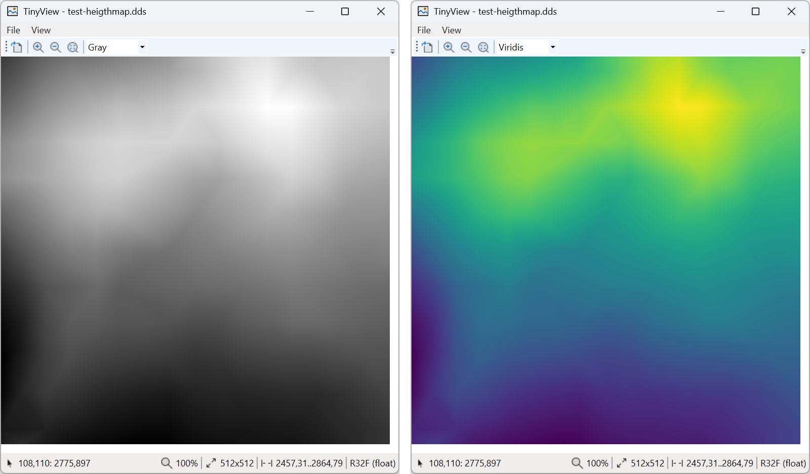

# TinyView

[](LICENSE)
[](https://github.com/pzychotic/TinyView/actions/workflows/ci.yml)

A specialized viewer for 16+32bit single channel images.
- PNG: 16-bit grayscale
- DDS: R16F, R32F

The pixel value range between min and max from the image will be scaled to 0-255 range for screen display. This allows to visualize data encoded in images (e.g. heightmaps) that usually can't be displayed by normal image viewers.
Additional to the grayscale display, different color maps are available that also work for common types of color blindness.
The mouse over will display the raw pixel value under the cursor in the status bar.



## Build
### From the command line

Prerequisites:
- .NET SDK 10.0 - install from https://dotnet.microsoft.com/

Build and run:
1. Build:
   ```
   dotnet build
   ```
2. Test (optional):
   ```
   dotnet test
   ```
4. Run:
   ```
   dotnet run --project Source\TinyView\TinyView.csproj
   ```

### From Visual Studio 2026

Prerequisites:
- .Net Desktop development workload
- .Net 10.0 Runtime
- .Net SDK

Just open ```TinyView.slnx``` build and run.

## Dependencies
- [Magick.Net](https://github.com/dlemstra/Magick.NET) for PNG file loading
- [Pfim](https://github.com/nickbabcock/Pfim) for DDS file loading

## References
- ColorMaps created from [viridisLite](https://github.com/sjmgarnier/viridisLite)
